# PR #5 — PetID tasarım ve Gboard kanıtları

12 Eylül 2026. Aynı dal/PR; `v1-release` hedefi, draft. Görseller sentetik demo hayvanları ve yerel test PNG'sidir; özel kullanıcı verisi yoktur. Android API 37 / Google 16KB x86_64 / 420dpi; development client ve güncel yerel Metro kaynakları. Debug Tools balonu görülebilir. Bunlar fiziksel Android/iOS veya production QA değildir.

## Referans ve karşılaştırma

Web kaynakları: `app/src/styles/preserved-shell.css` (kök/.phone.dark, pet-pill, hero, mod-card) ve `shell.css` (yüzen nav/yeşil aktif pill). Web kaynaklarına değişiklik yapılmadı. Web ana ekranındaki gün-saat dekoratif sahne ve ertelenmiş Pixel Pet yerine son talimattaki yeşil hero/pati karakteri native olarak kullanıldı; örnek sağlık/QR güven iddiaları geri getirilmedi.

| Eski web referansı | Önceki Expo görünümü | Yeni native PetID |
| --- | --- | --- |
| 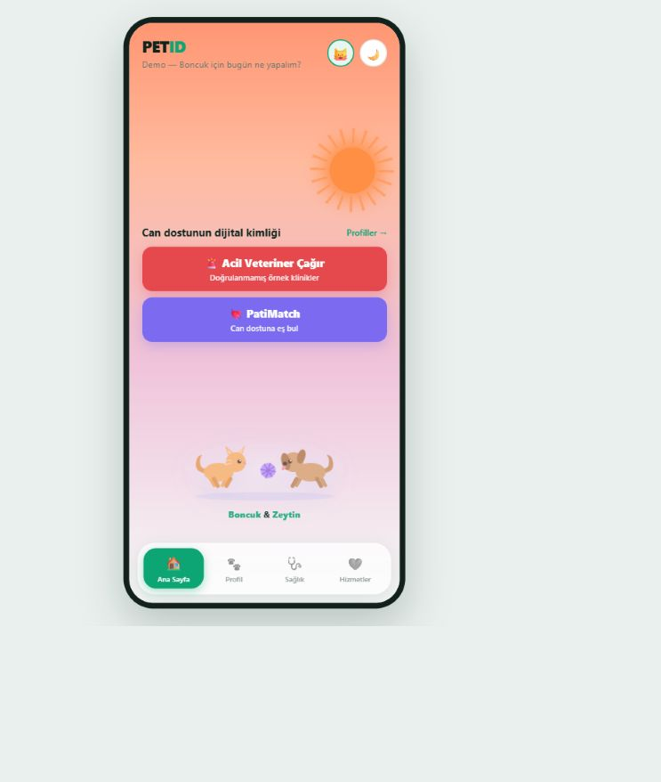 | 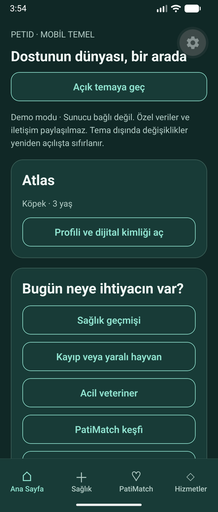 | 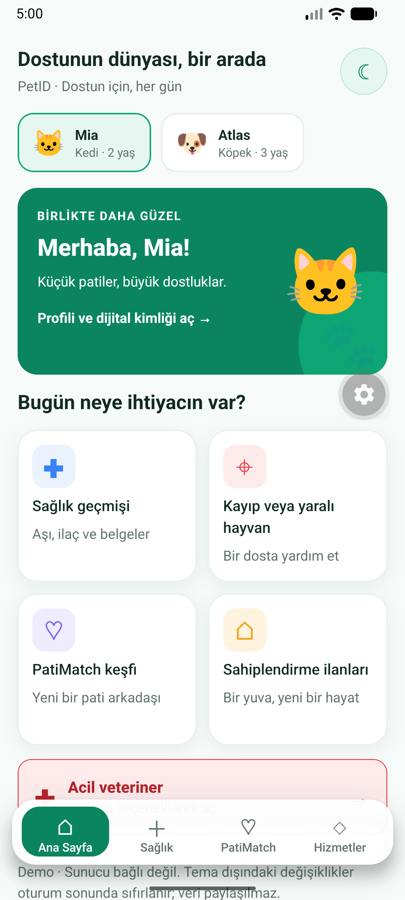 |
| 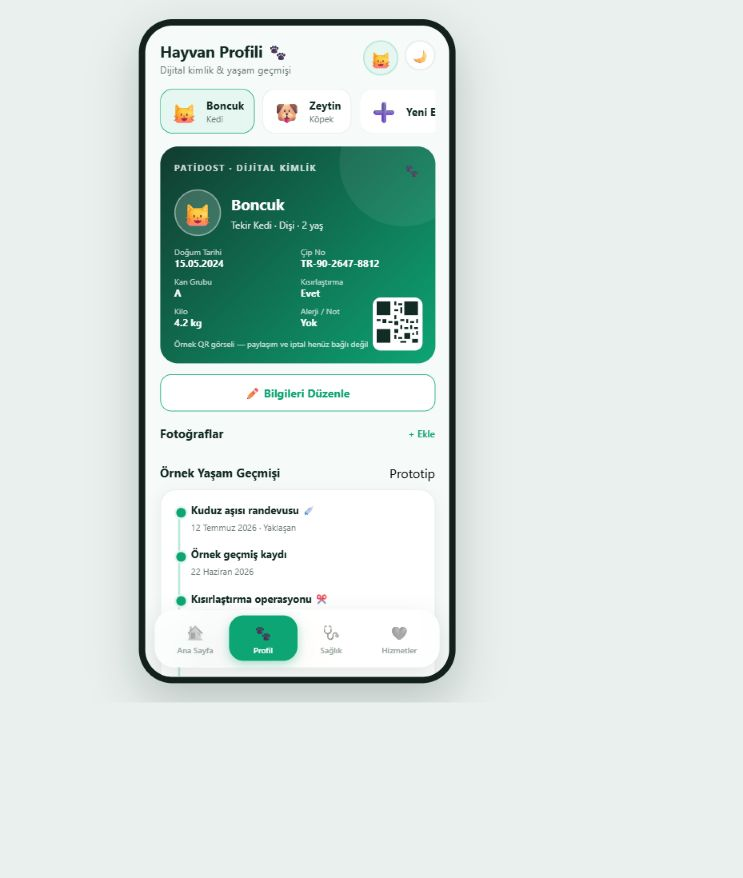 | 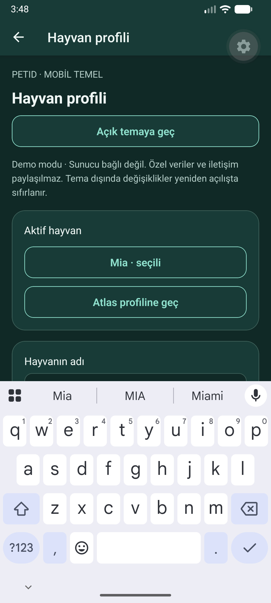 | 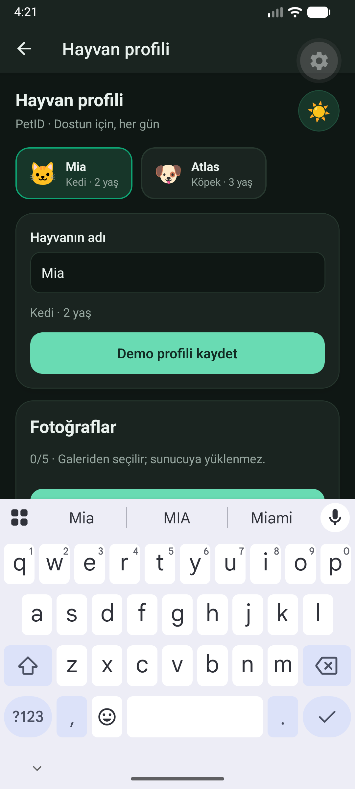 |

## Koyu tema ve küçük ekran

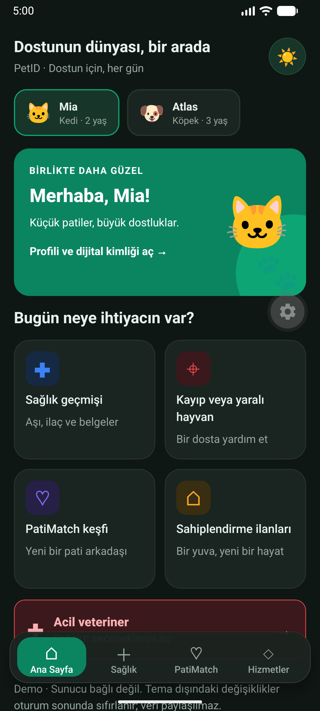

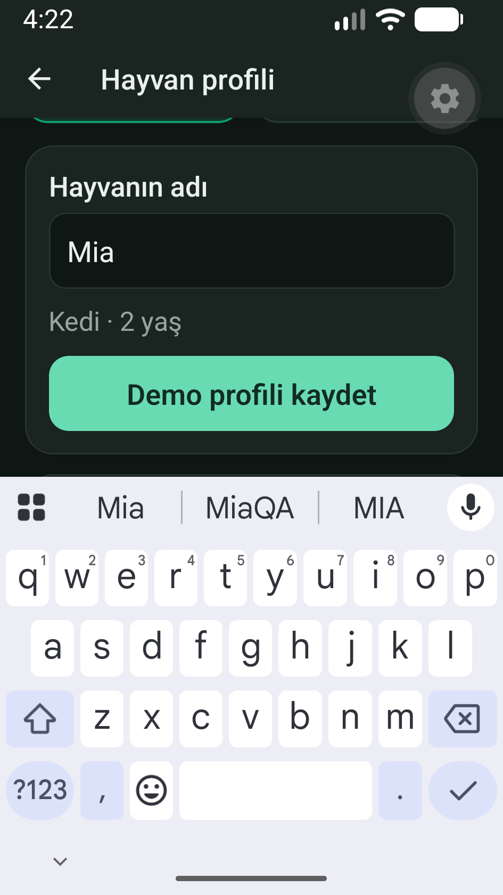

Küçük ekran ölçümü: IME üstü 895px; etiket 318–384, input 399–542, kaydet 668–809px. Üçü otomatik scroll sonrası klavye üzerinde. Açık klavyede düzenle/kaydet, kaydır ve ilk geriyle klavyeyi kapat/ikinci geriyle profilden dön kontrolü yapıldı. Test sonrasında wm size/font_scale ve test klavye ayarları geri alınır.

## İşlev kanıtları

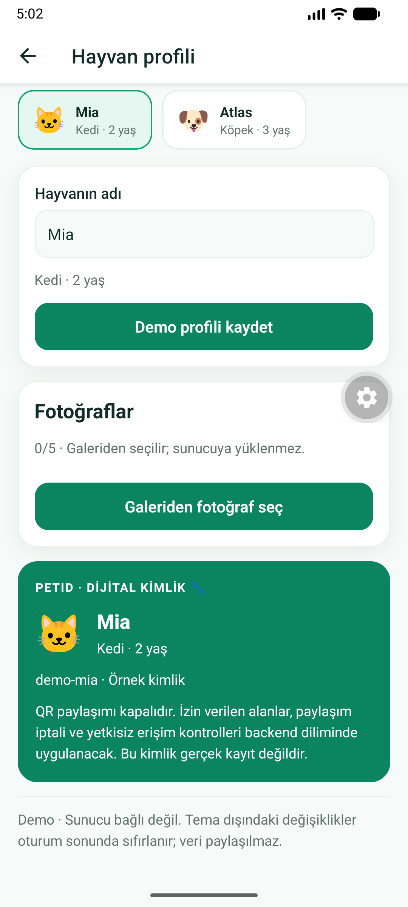

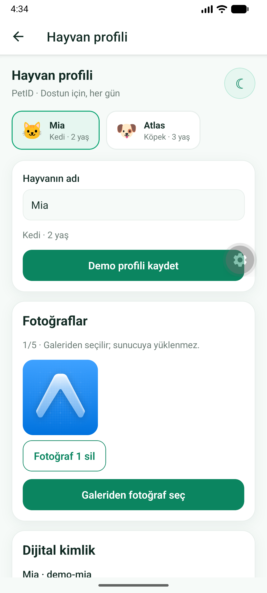

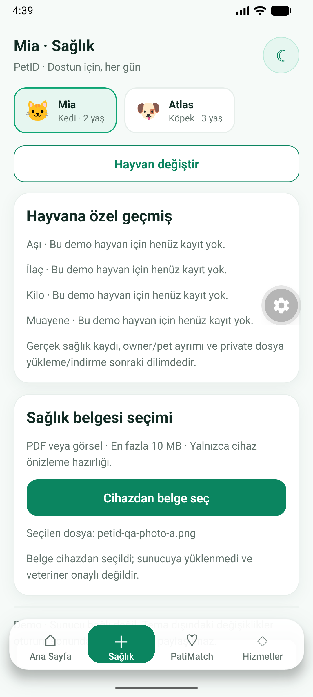

Gerçek Android photo picker ve DocumentsUI kullanıldı. Fotoğraf Mia 1/5, Atlas 0/5; sağlık dosyası Mia'da görünür, Atlas'ta yok. Sunucuya yükleme, gerçek ilan/arama/mesaj yoktur.

## Otomatik kontroller ve açık kapılar

6 suite / 34 test: ilk 28 test + IME overlap/double resize, focus scroll, küçük/büyük yazı, marka tokenları, AA kontrast ve profil odak/kaydet/hayvan ayrımı. TypeScript ve lint sıfır uyarı. Android Hermes ve 17 web route export; eski web 14/14 test + Vite build. Native APK/son kontrol ayrıntıları `V1_SLICE2_REPORT.md` içindedir.

AA için orijinal #0EA574 korunur; beyaz küçük etiketler #0B8560 üzerinde, orijinal #6B7B75'in küçük yazı karşılığı #62726C kullanılır. Koyu palet .phone.dark yüzeylerini ve aynı marka vurgu renklerini korur. Touch hedefleri ≥48dp; alt bar safe-area ve yazı ölçeğiyle büyür.

Otomatik GPS başarı testi kullanıcı kararıyla açık. Ekran/font değişiminde Expo dev-client `unregistered ActivityResultLauncher` bulgusu cold start ile toparlandı; configuration-change/process-death kurtarması ayrıca açık. Fiziksel/stabil Android, OS kısıtlı galeri/kalıcı ret, WhatsApp, tam predictive back ve iOS QA tamamlanmış sayılmaz. PR draft kalır; merge/production yayın yapılmaz.
