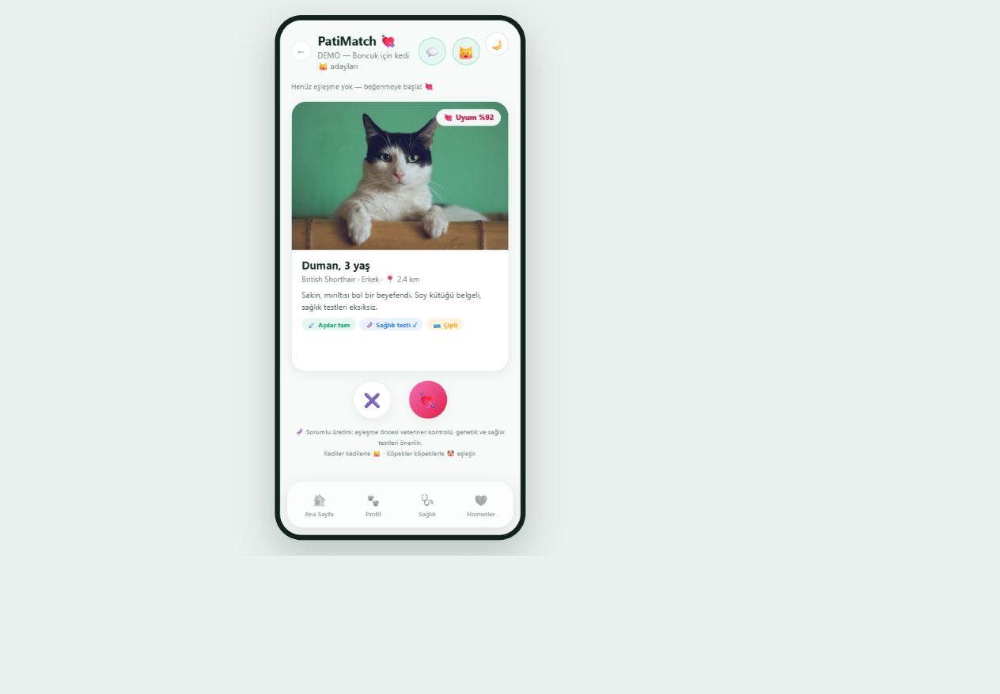
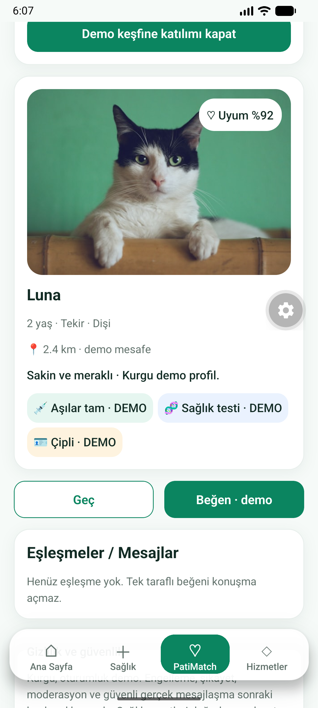
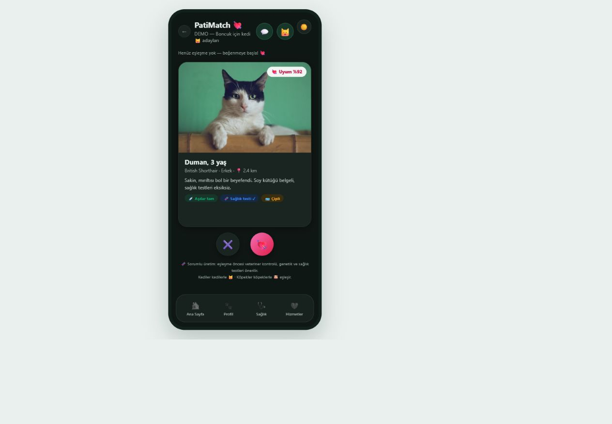
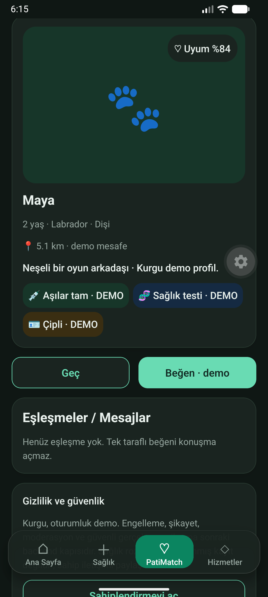
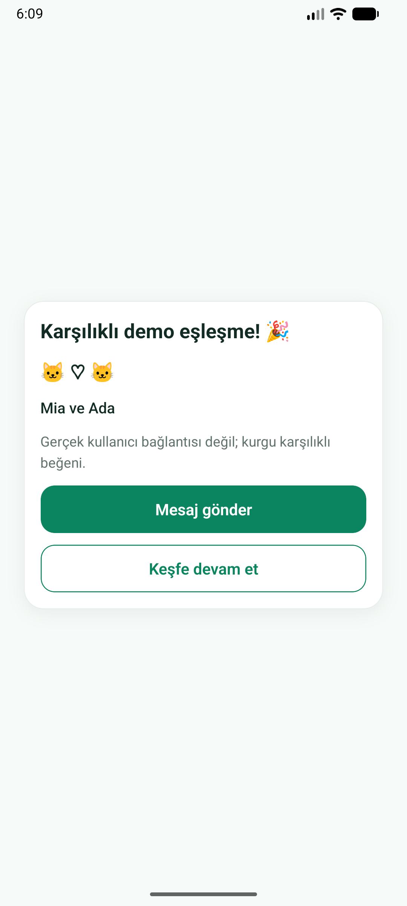
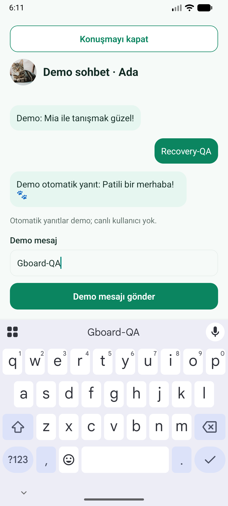

# PR #5 PatiMatch kurtarma

Uzak dalın 7438bcc commit'inden temiz clone; kayıp ad73544 kullanılmadı. Eski web `match.js`, `messages.js`, `match.css`, `messages.css`, `ai-chat.css` ve tipli olmayan demo havuzu referans alındı. Native RN kart/avatar/balon/modal kullanılır; WebView yok.

| Eski web | Native mobil |
| --- | --- |
|  |  |
|  |  |

Demo fotoğraflar eski webdeki Unsplash kaynakları; kurgu adaylar ve demo mesafe/sağlık etiketleri. Kullanıcı fotoğrafı veya canlı mesaj yok. API37 Google16KB x86_64 emülatör; development client + güncel Metro kaynakları, bağımsız preview değildir.

Kontroller: Luna sağa swipe tek taraflı beğeni ve Ada'ya ilerleme; Ada düğmeyle karşılıklı kutlama; mesaj gönder, düz metin ve açık demo yanıt; normal Gboard alan/input/gönder görünür. IME üstü1517px, input1184–1310, gönder1342–1468px. Gönder sonrası otomatik scroll; geriyle klavye kapatma/konuşma kapatma. Atlas ayrı havuz/boş konuşma, Max köpek; koyu tema. Ek sonuçlar PR yorumunda ve V1_SLICE2_REPORT.md.

42 test /7suite (ilk34korunur), TypeScript, lint, Expo Android Hermes ve17webroute export geçti. Doctor21/21; eskiweb14/14+Vitebuild. UI regression reduced motion + keyboard focus/listeners/composer + tür geçişi; model tür enjeksiyonu, geç/reset/tükenme, tek/karşılıklı beğeni/idempotency, pet izolasyonu, okunmamış/okundu, boş/500sınırı ve düzmetin.

Reply zamanlayıcıları ekran/pet remount'unun cleanup'ında iptal edilir; açık olmayan konuşma için snapshot tabanlı reducer doğrulaması bulunur. Keşfi resetlemek beğeni/konuşmayı silmez ve yeniden aynı adayı beğenmek mükerrer thread oluşturmaz. Tür tutarsızlığı discovery/like/read/send/reply katmanında reddedilir. Engelle/şikayet/moderasyon backend kapısıdır; aktif özellik gösterilmez.

Picker configuration-change/process-death, bağımsız preview cold-start, fiziksel/stabil Android, iOS ve GPS başarı kapıları açık. PR draft; merge/EAS Update/Submit/production yayın yok. GitHub'a push ve PR head SHA doğrulaması zorunlu teslim kapısıdır; CI sonucu PR'da yayınlanır.
