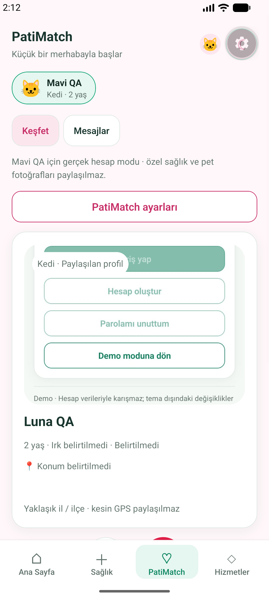
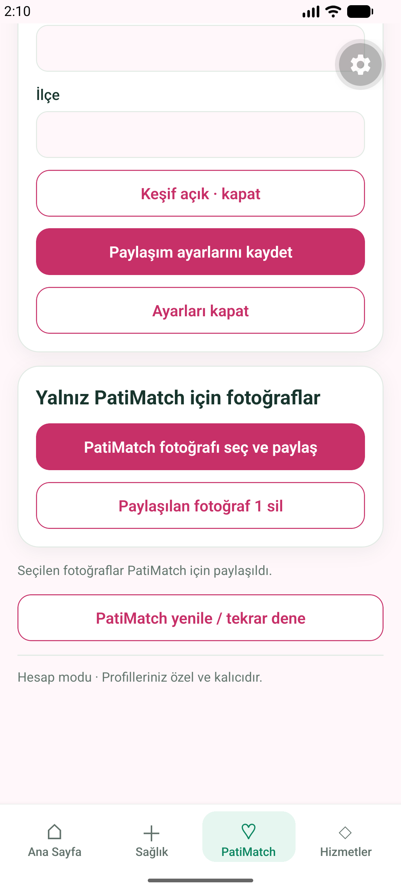
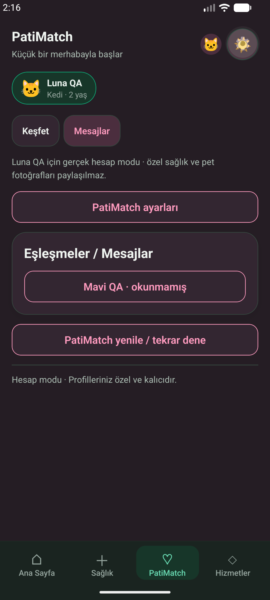
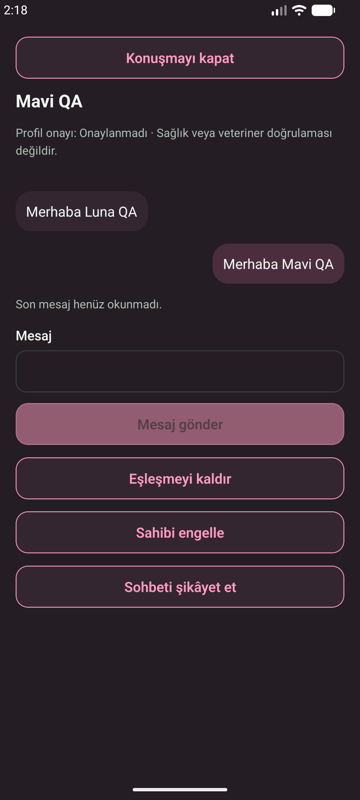

# Slice 5 — Issue #10

Windows checkout: `C:\Users\kaanb\Documents\Codex\2026-09-12\github-plugin-github-openai-curated-remote-4\work\petid2-recovery`.
Fetched all origin branch refs. Clean previous working tree retained on slice-3.
Switched to `codex/v1-slice-5-match-backend` at verified PR #9 head
`67ffe9439ccda411ac53d70d06627eb21190dee3`. Stacked base: `codex/v1-slice-4-core-data`.
No legacy web/Vite edits; PR #7 and #9 branches are untouched.

## Architecture

Explicit opt-in `match_profiles` are independent from private pets/health. Approximate
city/district only; no coordinate or health field. Separate private `match-media` bucket,
random UUID object names and metadata authorization; users pick photos explicitly.
Private SECURITY DEFINER helpers check auth/owner, use fixed empty search_path,
revoke PUBLIC/anon execute. Exposed RPC wrappers are SECURITY INVOKER.
No client secret/service-role key. Pair constraints, unique likes/matches/conversation,
derived participants, serialized like/send/block/unmatch and request UUID send deduplication.
Only server controls pending/verified/rejected; UI says this is not veterinary verification.
Block is owner-to-owner, bidirectional; unmatch permanently closes the pair in this slice.
No unblock/re-match UI is promised. Report content is reporter-only (moderation can read server-side).

Real account state is keyed by user/pet, separate from demo reducer. Polling every five seconds
while foreground + foreground reload, cleanup on unmount; no broadcast/subscription/public topic.
RLS rechecked on each snapshot/download. Latest 200 messages per thread are loaded (no older-history UI yet).
No optimistic writes: failed likes retain candidate; failed send retains draft and request ID.
Private media is downloaded with JWT and cached only for the mounted candidate; cache cleaned on unmount.
Shared photos are decoded and re-encoded as a new JPEG via pinned SDK-compatible image manipulator,
without copying source EXIF/GPS metadata; original private gallery remains untouched. RN Blob reads use native
FileReader rather than unsupported Blob.arrayBuffer. Pet deletion cleans match objects before metadata cascade.
Already downloaded bytes cannot be recalled. Storage signed URLs requested by other authorized clients
remain valid until expiry; native code does not create them. This is not a claim of retroactive media revocation.

## Reproduce (Node 24, Supabase CLI 2.117.0)

CLI help checked before migration creation/reset/lint/advisors/test/start.
Migration generated using `supabase migration new match_backend`.
Official changelog reviewed including Realtime schema lock-down and extension-version changes;
we do not alter realtime schema or pin extension versions.
Docs: [Auth](https://supabase.com/docs/guides/auth),
[RLS](https://supabase.com/docs/guides/database/postgres/row-level-security),
[Storage](https://supabase.com/docs/guides/storage/security/access-control),
[Realtime](https://supabase.com/docs/guides/realtime/postgres-changes),
[changelog](https://supabase.com/changelog).

From mobile: `npm ci`, `npm run typecheck`, `npm run lint`, `npm test`,
`npx expo-doctor`, `npm run build:android:js`, `npm run build:web`.
Local Linux CI: start ephemeral Supabase, `db reset --local --no-seed --yes`,
`db lint --local --fail-on error` (public + private),
`db advisors --local --type security --fail-on error`, `test db`, then both
`scripts/local-security.mjs` and `scripts/local-match-security.mjs` with local publishable key only.
Three synthetic example.test users: cat/cat + dog/dog mutual; concurrent duplicate likes;
self/same-owner/cross-species/forged owner/inactive rejected; send/read/idempotency;
third-party isolation; unmatch/block; report privacy; candidate-media/private-gallery isolation.
pgTAP additionally populates server-controlled verification and tests before/after mutual visibility.

## Windows Android follow-up — 2026-09-14

Docker Desktop and emulator-5554 are now accessible. Local database lint/security advisors,
117 pgTAP tests and both real Auth/API/Storage security matrices passed on Windows.
Node 24: TypeScript, lint, 80 Jest tests (13 suites), Doctor 21/21 and Android/web exports passed.
Local x86_64 debug native build passed. Installed separate `com.petid.app.dev` / PetID Dev;
old `com.petid.app.preview` was preserved (it was the PR #7 232e49e APK, not this slice).
Only localhost Supabase and Metro via adb reverse are used; Dev requires both running.

Two synthetic local accounts with Luna QA / Mavi QA: sign-in, explicit discovery opt-in,
single-like without conversation, right-swipe reciprocal match, native photo picker/upload,
authorized candidate photo display, two-way messages, unread/read state and force-stop/relaunch
with session, dark theme and messages restored passed. Screenshots below are real emulator captures.
Native UUID generation failed with absent global Web Crypto: corrected to explicit Expo crypto
for match IDs and existing pet/health uploads, with regression coverage. Removed literal JSX space
from first-pet form that generated an Android raw-text warning during initial hydration.

Photo permission denial and EXIF forensic inspection remain open. Gboard started in stylus mode
with a first-run tutorial; tutorial was cancelled and message entry/send worked in that IME mode.
Full docked-keyboard overlap QA is NOT claimed. Native block/unmatch/report UI and automatic GPS
success remain open; backend security matrices cover block/unmatch/report authorization.
Windows long-path CMake limitation was worked around with a temporary P: mapping to this SAME
checkout and a local generated-build path init script outside the repository; no source move or
global OS/SDK/security configuration change. No APK artifact or deployment is promised by CI.

Final remote SHA and CI results are recorded in the stacked draft PR after runs complete.
No cloud Supabase project, real accounts, EAS, merge or production operation.
