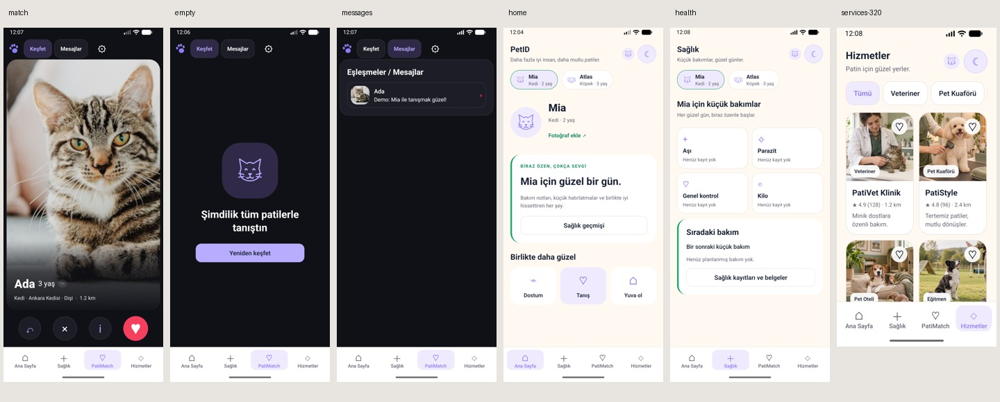

# Revision 2 — native B visual completion

Requested by [PR #12 comment](https://github.com/Leo-P90/petid2/pull/12#issuecomment-5672427840). Evidence captured 2026-09-15 from PetID Dev 0.3.0 (versionCode 3), native Android x86_64 emulator, updated with install -r and local IPv4 Metro. Previous revision evidence is preserved one directory above.

## Visual changes and evidence

- [PatiMatch candidate](rev2-match.png): cover photo occupies 1697 of 1943 px between top segments and bottom actions (~87% of content area, ~76% of app viewport); Ada face remains visible with 18% horizontal focus. Gradient, compact truthful neutral approval marker and metadata; undo/info 58dp, pass 62dp, red filled like 64dp. Server verification is never invented.
- [Exhausted discovery](rev2-empty.png): local line illustration, exact requested title and single rediscover action. Likes and conversations survive rediscovery; old debug reset controls removed in demo and live empty states.
- [Messages](rev2-messages.png): separate local segment, one global bottom navigation. Mutual demo like created Ada conversation; Merhaba send produced demo automatic reply.
- [Home light](rev2-home.png): small species avatar with photo action, care summary and three quick actions.
- [Health light](rev2-health.png): compact 2x2 truthful summary and one next-care card, neutral surfaces and green accent.
- [Services light at 320dp](rev2-services-320.png), [lower cards](rev2-services-lower-320.png): distinct veterinary/grooming/boarding/training photos, two columns, readable wrapping, 48dp favorite targets with smaller visual circles. Horizontal swipe revealed Eğitmen; selecting it showed only PatiAkademi. Lower cards and secondary community destinations remain scrollable.

Compared with prior b-cold-start, b-patimatch, b-services-320dp and b-health-light: large home paw hero removed; Ada alignment repaired; exhausted debug panel removed; duplicate service imagery replaced; health cards compressed and neutralized.

## Native checks

Cold launch succeeded. Grey floating gear was Expo Dev Menu FAB (not product settings); development-only config plugin sets EXDevMenuShowFloatingActionButton=false in Android manifest. No floating Tools overlay appears in final captures. PatiMatch settings remain accessible separately.

Sola swipe advanced Luna to Ada; undo restored Luna; another swipe and filled red heart created mutual demo conversation. Send and reply verified. [Docked Gboard](rev2-gboard.png): input and send stayed above IME and bottom tabs hidden. First IME mode was stylus handwriting; switched to docked Gboard for actual overlap evidence. Temporary keyboard/display overrides restored. Android back returned from chat/profile correctly.

Photo picker cancellation left 0/5 and explicit cancellation message. Selecting first local QA screenshot then Done produced 1/5 and visible image in profile; removed this newly added QA fixture afterward. It is not animal imagery or visual acceptance evidence. Existing app data preserved by update installation.

## Final local validation

- TypeScript: pass; ESLint zero warnings: pass.
- Jest: 14 suites, 94 tests pass (existing 90 plus focus, exhausted controls, horizontal categories, compact home regressions). Existing single-tab/keyboard/back guards retained.
- Expo Doctor: 21/21 pass.
- Android JS export: pass, 1390 modules, 33 assets.
- Web static export: pass, 19 routes.
- Native :app:assembleDebug x86_64: BUILD SUCCESSFUL, 475 tasks. install -r: Success.
- APK: PetID-Dev-B-Revision2-x86_64.apk, 92,469,648 bytes; SHA256 f0d0e9835f1fee09e5c8a568ec326869dbb98660b0985abc3021dfe2bde6b09f.

This is an Expo development client APK and needs local Metro; it is not a standalone production build. No EAS, merge or production publication. Remote delivery/head SHA and CI are recorded in PR #12 after push.

## Asset provenance

Four fictional service photos generated with built-in imagegen, committed under assets/images/services. No copied service logos or claims of real businesses. Common prompt: fictional premium friendly editorial service photo, warm cream/sage room or field, safe centered crop, no text, logo, watermark or collage. Scene prompts: veterinarian using stethoscope on calm cat; groomer brushing poodle; beagle resting in boarding room bed; border collie following trainer hand in outdoor field. Local cat/dog avatars are original line artwork rasterized to transparent PNG because Android did not render SVG data URIs.
